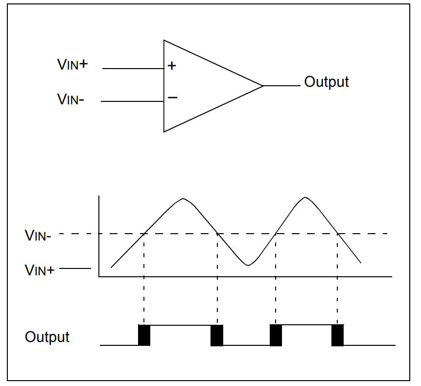

# DPI_Comparador

### Direct Programming Interface (DPI)

### Ejemplo de como usar DPI, En este caso, se realizó el programa de un comparador en c y en RTL usando SytemVerilog. Y al final comparamos ambas salidas a través del testbench.

