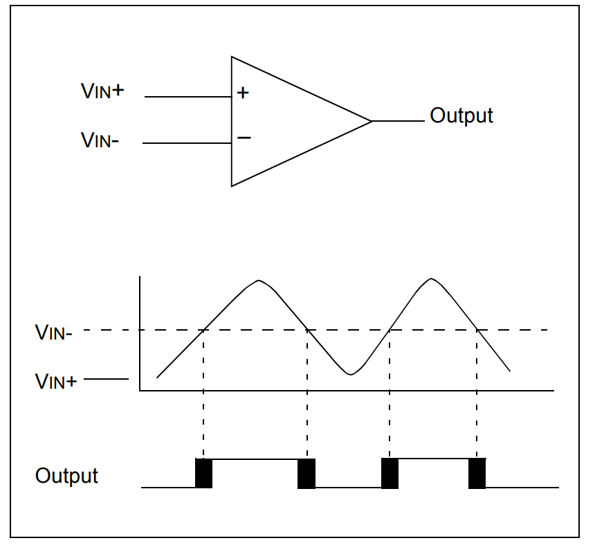

# DPI_Comparador

### Direct Programming Interface (DPI)

### Ejemplo de como usar DPI, En este caso, se realizó el programa de un comparador en c y en RTL usando SytemVerilog. Y al final comparamos ambas salidas a través del testbench.

#### Colocar en el bash lo siguiente
- setenv GIT_ROOT `git rev-parse --show-toplevel`
- setenv UVM_WORK $GIT_ROOT/work/uvm
- mkdir -p $UVM_WORK && cd $UVM_WORK
- ln -sf $GIT_ROOT/hw/Makefile/Makefile.vcs Makefile